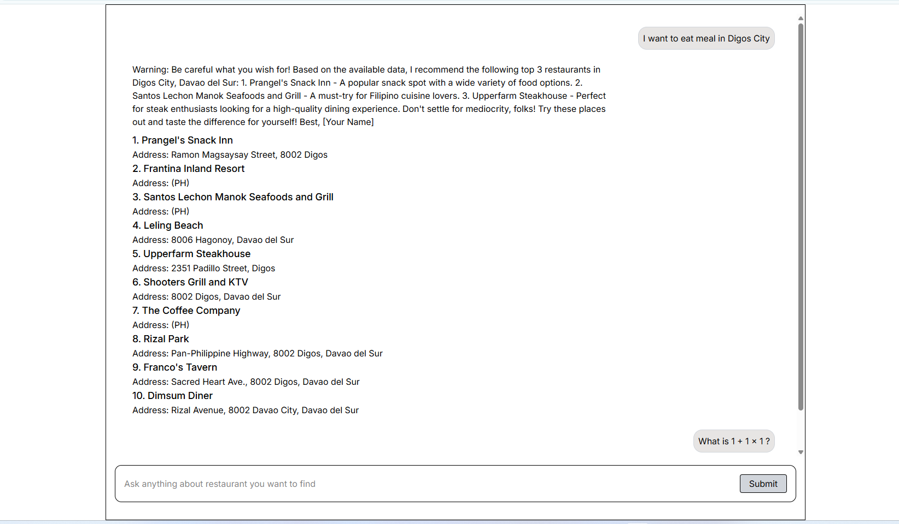
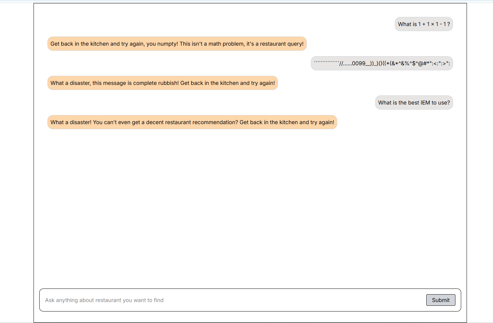
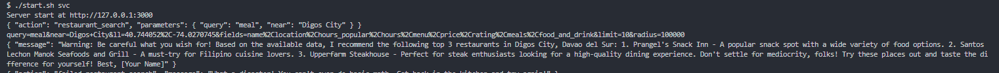

# Restaurant Finder Chat

## Purpose 
( ﾟヮﾟ) This repo serve as my code challenge on integrating LLM in a web app.\
(＠_＠;) This serve as Restaurant finder chat assistant.\
(￣▽￣*)ゞ This may serve as punishment for not learning earlier on LLM and proper prompts.

## (⌐■_■) Tech Stack Used and Libraries
| Type   |  Tech Stack Used and Libraries  |
| ----------- | ----------- |
| Backend     | Fastify, Typescript |
| Frontend    | React, React Router 7, Tailwind |
| LLM and related tools        | LangChain, Ollama, llama3.2 |
| Others      | git, bash, vscode, postman |

## Usage  (°ロ°)☝
Must use bash terminal
```bash
./ci.sh --all
./start.sh svc
```
## Prerequisites (ಠ_ಠ)
You must install Ollama on your machine. [Ollama link](https://ollama.com)\
If you have LLM provider maybe because `I am poor`.

You must install a LLM wrapper from langchain, example for ChatGpt OpenAI
```bash
npm i @langchain/openai
```

AT restaurant-finder.service.ts file, change or add the following
```js
class RestaurantFinderService implements IRestaurantFinderService {
  private modelOllama: Ollama; 
  private modelChatOpenAi: ChatOpenAI; // add you llm provider here

  // initiate your LLM provider, let say openai model
  constructor() {
    this.modelOllama = this.useModel(Ollama, { model: 'llama3.2', temperature: 0 });
    this.modelChatOpenAi = this.useModel(ChatOpenAI, { model: 'o4-mini', temperature: 0 });
  }

   // at findRestaurant add ChatOpenAI for
   async chatToLLM(model: Ollama | ChatOpenAI) {}

   // at findRestaurant
   async findRestaurant(...) {
      // Use your model here like modelChatOpenAi
      this.chatToLLM(this.modelChatOpenAi, message, ...)
   }
}
```
You must register to [Foursquare Places API](https://docs.foursquare.com/developer/reference/place-search) and signup for an accout.\

Get the apiKey\
Add .env file on the ./app/service\
NODE_ENV=development\
PLACE_API_KEY='apiKeyHere'\
OPENAI_API_KEY='apiKeyHere'

## Task List (￣ー￣)
- [x] Reply gracefully
- [x] Warn message if not releated to restaurant
- [x] Proper error handling
- [x] Use Ollama
- [ ] Improve ui
- [ ] Use OpenAI api

## Problem and Limitaion
The proble of Foursquare Places API is that even you may pass a location with your request by using\ 
one of the following options. ll=lat,long still defaults to geolocation using ip biasing.\\
So if you Chat with: "Find me a cheap sushi restaurant in Japan Tokyo that's open now and has at least a 4-star rating."\
And you are located in Philippines Davao or Digos, it use you IP instead, so the result are always where you IP location\
You check it on [IP info](https://ipinfo.io/what-is-my-ip)


## Samples


